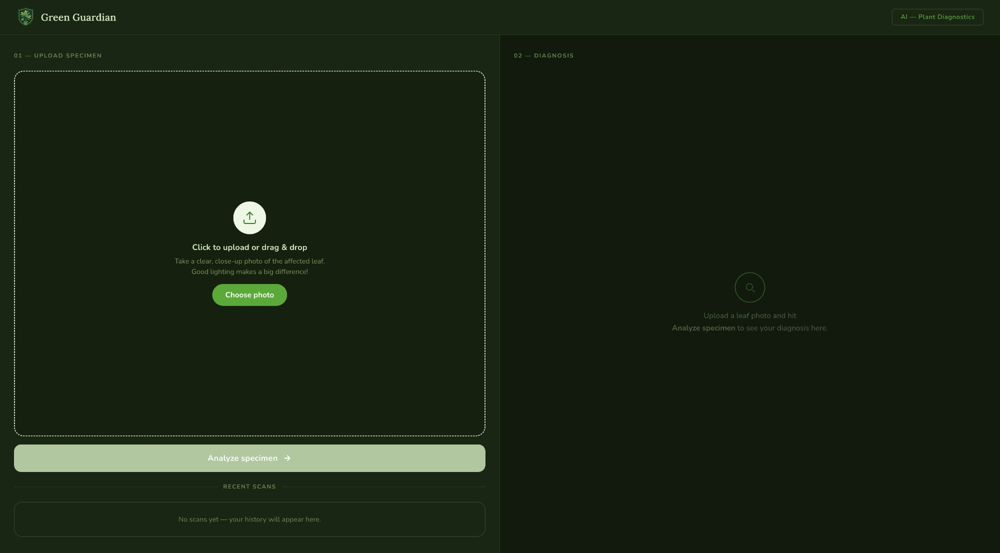

<p align="center">
  
</p>

<h1 align="center">Green Guardian</h1>

<p align="center">
  AI-powered plant disease detection from leaf photos.
  <br />
  Upload an image, get an instant diagnosis with confidence scoring and treatment advice.
  <br /><br />
  <a href="https://greenguardian.dev"><strong>Green Guardian Website</strong></a>
</p>

<p align="center">
  
  
  
  
  
  
  
  
  
  
  
  
</p>

---

<p align="center">
  
</p>

## About

Green Guardian is a full-stack web application that uses a custom-trained PyTorch model to identify plant diseases from leaf photographs. The model was trained on the [PlantVillage](https://www.kaggle.com/datasets/emmarex/plantdisease) dataset and classifies 15 conditions across three plant types (tomato, potato, and bell pepper), returning real-time predictions with confidence levels.

### What It Does

- Upload a `.jpg`, `.jpeg`, or `.png` leaf photo and receive an instant diagnosis
- View confidence scores, disease descriptions, and step-by-step treatment recommendations
- Track recent scans in-session with a scan history panel
- Responsive two-panel layout with a clean, minimal UI

## Tech Stack

| Layer | Technology |
|-------|------------|
| Frontend | Next.js 15, React 19, TypeScript, Tailwind CSS 4 |
| Backend | FastAPI, Mangum (AWS Lambda adapter) |
| ML Model | PyTorch, TorchVision (ResNet-based classifier) |
| Dataset | [PlantVillage](https://www.kaggle.com/datasets/emmarex/plantdisease), 15 classes |
| Infrastructure | AWS Lambda, ECR, S3, CloudFront |
| CI/CD | GitHub Actions (auto-deploy on push to `main`) |

## Architecture

```
User → CloudFront → S3 (static Next.js export)
                        ↓
              Upload image via /predict
                        ↓
              API Gateway → Lambda (Docker)
                        ↓
              FastAPI → PyTorch model → response
```

The frontend is a statically exported Next.js app hosted on S3 behind CloudFront. The backend runs as a Dockerized FastAPI app on AWS Lambda, with the PyTorch model bundled in the container image via ECR.

## Supported Classifications

| Plant | Conditions |
|-------|------------|
| Tomato | Bacterial Spot, Early Blight, Late Blight, Leaf Mold, Septoria Leaf Spot, Spider Mites, Target Spot, Yellow Leaf Curl Virus, Mosaic Virus, Healthy |
| Potato | Early Blight, Late Blight, Healthy |
| Bell Pepper | Bacterial Spot, Healthy |

## Run Locally

### Prerequisites

- Python 3.9+
- Node.js 20+
- `model.pt` in `backend/model/` (train with `python train.py` or provide your own)

### Backend

```bash
git clone https://github.com/kameron-ctrl/GreenGuardian
cd GreenGuardian/backend

python -m venv venv
source venv/bin/activate
pip install -r requirements.txt

uvicorn main:app --host 0.0.0.0 --port 8000
```

The API will be available at `http://localhost:8000`. Test with `GET /` for a health check or `POST /predict` with a multipart file upload.

### Web App

```bash
cd web
npm install
npm run dev
```

Open `http://localhost:3000`. By default the app points to the production API. To use your local backend, create a `.env.local` file in the `web/` directory:

```
NEXT_PUBLIC_API_URL=http://localhost:8000
```

## Deployment

Deployment is fully automated via GitHub Actions. Pushing to `main` triggers the workflow in `.github/workflows/deploy.yml`, which:

1. **Detects changes**: only rebuilds what changed (`web/` or `backend/`)
2. **Backend**: builds a Docker image, pushes to ECR, and updates the Lambda function
3. **Frontend**: runs `next build`, syncs the static export to S3, and invalidates the CloudFront cache

Required GitHub Secrets: `AWS_ACCESS_KEY_ID`, `AWS_SECRET_ACCESS_KEY`, `AWS_REGION`, `ECR_REPOSITORY`, `LAMBDA_FUNCTION_NAME`, `S3_BUCKET_NAME`, `CLOUDFRONT_DISTRIBUTION_ID`

## Project Structure

```
GreenGuardian/
├── backend/
│   ├── main.py              # FastAPI app with /predict endpoint
│   ├── lambdahandler.py     # Mangum adapter for AWS Lambda
│   ├── model/
│   │   ├── predictor.py     # PyTorch inference logic
│   │   ├── labels.json      # Class label mapping
│   │   └── model.pt         # Trained model weights
│   ├── train.py             # Model training script
│   ├── splitdataset.py      # Dataset splitting utility
│   ├── Dockerfile.lambda    # Lambda container definition
│   └── requirements.txt
├── web/
│   ├── src/
│   │   ├── app/
│   │   │   ├── page.tsx     # Main diagnostic page
│   │   │   ├── layout.tsx   # Root layout + metadata
│   │   │   └── globals.css  # Design tokens + typography
│   │   ├── components/
│   │   │   ├── DiagnoseForm.tsx      # Upload + image preview
│   │   │   ├── PredictionResult.tsx  # Diagnosis display + treatment
│   │   │   └── RecentScans.tsx       # Scan history sidebar
│   │   ├── lib/api.ts       # API client
│   │   └── types/prediction.ts
│   └── public/               # Static assets (logo, favicon, backgrounds)
└── .github/workflows/
    └── deploy.yml            # CI/CD pipeline
```

## License

[MIT](LICENSE)
